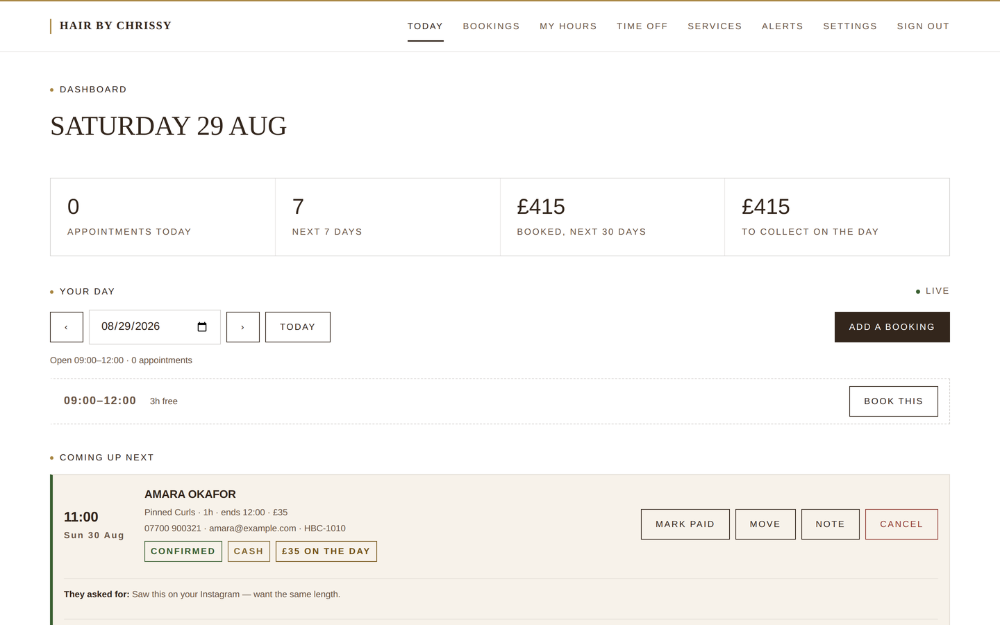

# H A I R • B Y • C H R I S S Y — booking platform

[](https://hairbychrissy.ysbdesigns.uk/)
&nbsp;
[](https://hairbychrissy.ysbdesigns.uk/book.html)

[](https://hairbychrissy.ysbdesigns.uk/)

**Live at [hairbychrissy.ysbdesigns.uk](https://hairbychrissy.ysbdesigns.uk/)** — no install, no sign-in.

A live-calendar booking site for [@hairbychrissy_x](https://www.instagram.com/hairbychrissy_x),
hair extension specialist, London.

Clients pick a service, see genuine live availability, choose a slot and pay by
**cash or card**. Chrissy sets her own working days, hours, breaks and time off
from a private dashboard — and the client calendar updates the moment she saves.

| | |
|---|---|
|  |  |
| **The booking page** — pick a service, a day, a time | **Her dashboard** — the day as a run sheet, gaps included |

> **The published link above runs in enquiry mode.** GitHub Pages serves static
> files, so it cannot run the booking engine — the live calendar, the event
> stream and the dashboard all need a Node host. Rather than show a calendar
> that looks live and is not, the published page falls back to the real price
> list and routes bookings to an enquiry. [Running it](#running-it) below gets
> the whole thing working locally in one command.

> **Draft.** Prices, services, copy and photography are now hers — taken from
> her price list, services and maintenance graphics. Still outstanding: service
> durations, real reviews, and contact details. See
> [CLIENT-NOTES.md](CLIENT-NOTES.md).

---

## Publishing

There are two deployments, and they are not interchangeable:

| | What it serves | Where |
|---|---|---|
| **GitHub Pages** | the site as flat files | [hairbychrissy.ysbdesigns.uk](https://hairbychrissy.ysbdesigns.uk/) |
| **Node** | the same site **plus the booking API** | any host that runs Node |

**GitHub Pages cannot run the booking engine.** Live availability, the event
stream, admin sessions, push notifications and payments are all server-side.
Published to Pages alone, the site shows the full price list and routes bookings
to an enquiry rather than pretending to hold a slot it cannot.

### Configuring Pages — one setting

`.github/workflows/pages.yml` publishes `public/` on every push **to `main`**.
One publisher only: it used to fire on a feature branch too, and both deploy to
the same Pages site, so whichever pushed last was the site you got. To preview
a branch before merging, run the workflow by hand from the Actions tab and pick
it there.

It needs one change, once:

> **Settings → Pages → Build and deployment → Source: `GitHub Actions`**

No `gh-pages` branch and no `/docs` folder — the workflow uploads the same
`public/` the Node app serves, so the two cannot drift. It regenerates
`public/data/site.json` on every deploy, so the published content always matches
`lib/seed.js`.

#### If the site sometimes shows the README

That one setting is the cause, and the symptom is intermittent, which makes it
hard to place. With the source set to **"Deploy from a branch"**, GitHub also
runs its own Jekyll build — `pages-build-deployment` — over the **repository
root**. The root has no `index.html`, and Jekyll falls back to rendering
`README.md` as the home page.

So two publishers are writing to one site:

| Publisher | Builds | Result |
|---|---|---|
| `pages.yml` (this workflow) | `public/` | the real site |
| `pages-build-deployment` (Jekyll) | the repo root | **README.md as the home page** |

Whichever deployed last is what a visitor gets, so a refresh can flip between
them. **To check:** open the Actions tab and look for runs of
`pages-build-deployment`. Any at all mean the source is still a branch. Setting
it to `GitHub Actions` stops that workflow running and the flipping with it.

A root `index.html` is committed as a safety net — it is not part of the site
and is never served under GitHub Actions, but if a Jekyll build ever wins the
race it redirects to the real site instead of showing the README.

#### The custom domain

`public/CNAME` holds `hairbychrissy.ysbdesigns.uk`, and it has to live there
rather than only at the repository root. This workflow publishes `public/` and
nothing outside it, so a root-only CNAME is invisible to it — every deploy from
here would drop the custom domain. The root copy is still read by the Jekyll
build, so both are kept and both say the same thing.

Because the site is served from a domain root rather than `/Hairbychrissy/`,
every asset path being relative — decided when this was first published to
Pages — is what lets the same files work under both.

### Making the published page book for real

Host the Node app somewhere (Render, Railway, Fly, a VPS), then:

1. Set the repository variable **`HBC_API`** to the API's base URL. The workflow
   injects `<meta name="hbc-api">` and the Pages site switches to the live
   calendar.
2. Set **`ALLOWED_ORIGINS`** on the Node app to the Pages origin, so CORS
   permits it. It is an allowlist and never `*` — the admin routes share that
   origin and carry a session cookie.

### Subpath safety

Pages serves from `/Hairbychrissy/`, not a domain root. Every asset path is
relative, and both scripts derive their base from their own URL via
`import.meta.url` rather than assuming `/`. The manifest uses `./` for
`start_url` and `scope`, so Add to Home Screen works from the subpath too.

## Running it

```bash
npm start          # http://localhost:3000
```

No `npm install` needed — the app has **zero runtime dependencies**, just Node 18+.

| URL | What it is |
|---|---|
| `/` | Client site — her work, prices, and the invitation to book |
| `/book` | The booking page: service, calendar, time, details |
| `/admin` | Chrissy's dashboard (default password `chrissy`) |
| `/confirmed?ref=…` | Booking confirmation |
| `/pay-demo?ref=…` | Simulated card checkout (draft mode only) |

Configuration is via environment variables — copy `.env.example` to `.env`.
Everything has a working default, so nothing must be set to try it out.

---

## The database — hooking up real bookings

Two backends, one interface. Which one runs is decided entirely by whether
`SUPABASE_URL` and `SUPABASE_SERVICE_KEY` are set.

| | Where the data lives | Use it when |
|---|---|---|
| **Supabase** | Postgres + Storage | **Production.** No disk to attach, survives every redeploy, bookings readable in the Supabase table editor |
| **JSON file** | `$DATA_DIR/` | Local development, the audit suite, or a host where a volume is simpler than a database |

Either way the working copy is **in memory**. The availability engine reads the
whole dataset many times per request — once per candidate slot — so putting a
network round trip behind each of those would make the calendar slow for no
benefit at this size. Reads are instant; `write()` persists.

```
db.json / hbc_state       services, hours, rules, blocked dates, counter
bookings / hbc_bookings   one record per appointment
uploads/<booking>/<n>     the photos that client attached
```

**It already works locally.** `npm start` and book something — it saves to
`./data`. Everything below is about making that survive being on the internet.

---

### Supabase — the recommended path

Six steps, none of which involve a disk.

**1. Run the schema.** Supabase dashboard → **SQL Editor** → New query → paste
[`supabase/schema.sql`](supabase/schema.sql) → Run. It creates two tables:

- `hbc_bookings` — one row per appointment, with `date`, `status`, `ref` and
  `client_name` promoted into real columns so the table is sortable and
  readable in the dashboard, plus the complete record as `jsonb`.
- `hbc_state` — a single row holding services, hours, rules, blocked dates,
  the reference counter, the alert log and the push keys. All configuration:
  small, read constantly, changed rarely.

It also enables row-level security with no policies. The app uses the
secret key, which bypasses RLS — so that is not what protects this data
day to day. It is there so that a leaked **anon** key, the one that is safe to
publish and therefore the one most likely to end up somewhere public, cannot
read a single client's phone number.

**2. Create the bucket.** Storage → **New bucket** → name `booking-photos`,
**Public OFF**. These are clients' private photographs. The app serves the
bytes itself through the authenticated admin route, so nothing is ever
reachable by URL alone.

**3. Set two environment variables** (Settings → API):

```bash
SUPABASE_URL=https://<project>.supabase.co
SUPABASE_SERVICE_KEY=<the secret key — sb_secret_...>
```

> The **secret** key — `sb_secret_...` in the current dashboard, `service_role`
> in the older one. **Not** the publishable key (`sb_publishable_...`,
> previously `anon`): RLS is on with no policies, so a publishable key can read
> and write nothing and the app fails on its first query. It is full access: server only,
> never in a browser, never committed. It cannot reach a browser here — the
> booking page talks to this app's API and never to Supabase directly.

**4. Move any existing bookings.**

```bash
node tools/supabase-migrate.js            # dry run — shows what would move
node tools/supabase-migrate.js --apply    # bookings, settings and photos
```

Safe to re-run; every write is an upsert keyed on the booking id, so a run that
fails halfway can just be run again. It never deletes your local files, and it
reads the row count back from Supabase at the end rather than trusting its own
writes.

**5. Restart, and check the banner.**

```
bookings     Supabase — 19 loaded
```

If it says `local file` instead, the two variables are not reaching the
process.

**6. Back it up.** See [Backups](#backups) below — it reads from Supabase once
configured, not from the stale local copy.

#### Supabase is the disk, not the server

Worth being explicit, because it is the step people skip: Supabase holds the
data, but something still has to run `server.js`. The GitHub Pages site is
static — it cannot reach Postgres, and should not (that would put a
full-access key in the browser). Until the API is hosted somewhere, the
booking page stays in enquiry mode and the Supabase tables stay empty.

[`render.yaml`](render.yaml) is a blueprint for that: **Render → New →
Blueprint → this repository**. It creates the service, generates
`SESSION_SECRET`, and prompts for the values it must not store in a public
repo. No disk is attached, on purpose — Supabase holds the bookings and the
photos, so a container filesystem that is thrown away on every deploy is
exactly what is wanted.

Two things to get right:

- **The branch must contain the Supabase backend.** Render's Blueprint form
  asks which branch holds `render.yaml`, and the service then follows that
  same branch — no branch is pinned inside the file, so the two cannot
  disagree. Point it at a branch without the Supabase backend and the app
  still starts, falls back to a local file, and Render erases that on every
  deploy — bookings disappear with no error anywhere. The startup log is the
  check: it must read `bookings     Supabase — N loaded`, never
  `bookings     local file`.
- **`PUBLIC_URL` is set by hand after the first deploy**, once Render has
  assigned the address. It is not wired to a service property because those
  give a bare host with no scheme, and it is used as a URL prefix for Stripe's
  redirects.

`GET /health` reports the storage backend, the booking count and the card
mode, so a misconfiguration is visible in one request rather than inferred
from a quiet diary:

```json
{ "ok": true, "storage": "supabase", "bookings": 0, "cardMode": "demo", "uptime": 4 }
```

On Render's free plan the service sleeps after inactivity and the first
request wakes it, which takes a few seconds — fine for a draft, worth paying
to remove before real clients are booking.

#### What happens when Supabase is unreachable

Two deliberate behaviours, because the failure this app exists to prevent is a
client holding a confirmation for a booking the stylist never received.

- **At boot it refuses to start.** Coming up healthy on an empty database is
  worse than not coming up: the first write would overwrite every real booking
  with nothing, and the only symptom until then is a quiet diary.
- **Mid-booking it returns 503, not 201.** The `POST /api/bookings` response is
  not sent until the row is actually stored. If the write fails the slot is
  released and the client is told plainly to try again — rather than being
  handed a confirmation for an appointment that does not exist.

Verified by forcing an outage: 503 returned, no row written, and the slot
bookable again immediately afterwards.

---

### The JSON file — the alternative

If you would rather not use Supabase, the file backend needs a persistent disk,
and there is exactly one way it goes wrong.

`DATA_DIR` defaults to `./data`, inside the checkout. On most hosts the
container filesystem is **rebuilt on every deploy**, so that default means the
site runs perfectly, takes real bookings, and loses all of them the next time
you push. Nothing errors. You find out when a client turns up. The startup
banner flags it:

```
bookings     local file — /app/data  (default — set DATA_DIR to a persistent disk, or configure Supabase)
```

| Host | Create the disk | Then set |
|---|---|---|
| **Fly.io** | `fly volumes create hbc_data --size 1` and a `[mounts]` block for `/data` | `DATA_DIR=/data` |
| **Render** | Add a **Disk**, mount path `/var/data` | `DATA_DIR=/var/data` |
| **Railway** | Add a **Volume**, mount path `/data` | `DATA_DIR=/data` |
| **A VPS** | Any directory you include in backups | `DATA_DIR=/srv/hbc-data` |

`DATA_DIR` is one variable rather than two on purpose: the database and the
photos must move together, or the pictures orphan on the next restart while the
bookings stay put and make it look as though nothing went wrong.

---

### The rest of the environment

```bash
ADMIN_PASSWORD=<something long>      # the dashboard warns while "chrissy" is in use
SESSION_SECRET=<32+ random chars>    # openssl rand -base64 32
PUBLIC_URL=https://api.yourhost.com  # this app's own public URL
ALLOWED_ORIGINS=https://hairbychrissy.ysbdesigns.uk
```

`ALLOWED_ORIGINS` is an explicit allowlist and must **never** be `*`: the admin
routes share this origin and carry a session cookie.

> **One process only.** The working copy is in memory, so two instances would
> each hold their own and overwrite each other. Set the replica count to **1**.
> This is the real ceiling of the design — see
> [When to outgrow this](#when-to-outgrow-this) — and Supabase does not lift it
> on its own.

### Pointing the published site at it

The GitHub Pages site is static and defaults to enquiry mode. To switch it to
the real calendar:

> **Settings → Secrets and variables → Actions → Variables → New variable**
> `HBC_API` = `https://api.yourhost.com`

Push anything, and the deploy injects that into `index.html`, `book.html` and
`confirmed.html`. Verify with:

```bash
curl -s https://hairbychrissy.ysbdesigns.uk/book.html | grep hbc-api
```

### Backups

```bash
npm run backup                 # -> backups/hbc-2026-08-29T2130.tar.gz
npm run backup /mnt/elsewhere  # or write it somewhere else
```

Reads from **whichever backend is configured** and says which. With Supabase
set it pulls from Postgres and Storage, not from the local files — archiving a
stale local copy while the real data lives elsewhere is worse than having no
backup, because it looks like one.

The archive has the same shape either way, so a Supabase backup restores into a
local checkout and vice versa. Restoring is deliberately a plain `tar`, not a
format of ours:

```bash
tar -xzf hbc-2026-08-29T2130.tar.gz -C "$DATA_DIR"
```

Nightly is ample for a diary:

```cron
0 3 * * *  cd /srv/hbc && npm run backup /srv/backups
```

**Archives are gitignored** (`backups/`, `*.tar.gz`). One of them is the entire
client list, their phone numbers and their photos in a single portable file.

### Check it survived

The only test that matters is a restart, because that is what a deploy is:

```bash
curl -s $PUBLIC_URL/api/bookings/HBC-1001   # book something first
# restart / redeploy
curl -s $PUBLIC_URL/api/bookings/HBC-1001   # must still be there
```

If the reference comes back and the next booking continues the numbering rather
than resetting to `HBC-1001`, it is wired up correctly.

### When to outgrow this

| Signal | Why it breaks | Move to |
|---|---|---|
| A second stylist, or 2+ app instances | Each process holds its own in-memory copy and they overwrite each other | Query Postgres directly instead of caching the whole dataset |
| Tens of thousands of bookings | The whole set is loaded on boot | Paginate, and query by date range |
| You need history — who changed what, when | There is one current state and no log | A Postgres audit table, or Supabase's own logs |

`read()` and `write()` in `lib/store.js` are the only ways anything touches the
data, which is what made adding a second backend a change to one file rather
than a change everywhere.

---

## The booking page

Every "Book your slot" on the site lands on `/book`, which walks four steps:

1. **What you're having done** — a dropdown of her real service list, with the
   price and rough duration shown the moment you choose. Availability is
   computed per service, so this has to come first: a 4-hour install and a
   1-hour blow dry fit her day differently.
2. **A day** — a month calendar, with days she cannot take you greyed out.
3. **A time** — the slots that actually fit that service on that day.
4. **You** — name, phone, email, a free-text note, and optional photos.

### Her week

| Day | Hours |
|---|---|
| Monday – Friday | 10:00 – 19:00 |
| Saturday | 09:00 – 12:00 |
| Sunday | 11:00 – 15:00 |

These are the seed defaults. Chrissy changes them in the dashboard at any time
without touching code, and the calendar follows immediately.

### Inspiration photos

Clients already send her a screenshot of the look they want — over Instagram,
separately from the booking — leaving her to match a picture to an appointment
from memory. The details step takes up to **five photos**, and they arrive
attached to the booking in her dashboard.

Three decisions worth knowing:

- **Photos upload after the booking exists.** A photo that fails to send must
  never cost someone their slot, so the appointment is made first and the
  pictures follow. If they fail, the booking still stands and both parties are
  told.
- **The upload is behind a one-time token.** Booking references are sequential
  and therefore guessable; the token is 24 random bytes, handed back once to
  the person who just booked and deleted the moment it is used.
- **The files never touch the public tree.** They are written to
  `data/uploads/`, outside `public/`, and served only through an
  authenticated admin route with `nosniff` and a `default-src 'none'` CSP.
  Type is decided by reading the file's magic bytes, never by trusting its
  extension or declared MIME — so an SVG, a script, or an HTML file dressed up
  as a `.jpg` is rejected.

Since the photos land a moment after the booking, her "new booking" email
carries the count the client declared, so she knows to go and look.

---

## How availability works

A slot appears to a client only when **all** of these hold:

- the weekday is switched on in Chrissy's working hours
- the date is not blocked off (holiday, personal day)
- the whole appointment fits inside that day's opening hours
- it does not overlap her lunch/break window
- it does not overlap an existing booking, with the clean-down buffer applied
  to **both** sides
- it is at least the minimum-notice period ahead of now
- it is inside the booking horizon

Because a 4-hour set and a 1-hour blow dry fit a day differently, availability
is always computed **per service** — the calendar changes shape depending on
what the client picked.

The client's slot list can be seconds out of date, so it is never trusted: the
server re-validates the slot at the moment of booking and returns a clear
"that time has just been taken" if two people race for it.

### "Live" is genuinely live

Every open browser holds a `Server-Sent Events` connection to `/api/stream`.
When anyone books, cancels, or when Chrissy changes her hours, the server pushes
an event and each client repaints its calendar **without a refresh**. Verified:
a second client booking a slot drops it out of the first client's view in under
a second.

---

## Pricing model

Her price list has three shapes, and the booking engine handles each:

| Shape | Example | What happens |
|---|---|---|
| **Price on request** | Extensions & fittings | Books a consultation. No payment offered, the card option is hidden, and the slot is held. She quotes in person. |
| **Fixed price, no deposit** | Hollywood waves, £30 | Cash pays on the day; card pays the full amount at booking. A zero-value checkout would be rejected by Stripe, so "deposit of £0" is never charged. |
| **Fixed price with deposit** | none currently | Deposit online, balance on the day. Set a deposit per service in the dashboard to switch a service to this. |

Deposits are all zero because her list does not mention any. Changing one in the
dashboard moves that service to the third shape with no code change.

## Payments — cash and card

Both options are offered on every booking.

| | Taken online | On the day | Booking status |
|---|---|---|---|
| **Cash** | nothing | full amount | confirmed immediately |
| **Card** | deposit | balance | confirmed once the deposit clears |

**Card is in draft mode.** With no `STRIPE_SECRET_KEY` set, the card route goes
to a simulated checkout inside this app so the whole journey is clickable — no
real money moves, and the page says so plainly. Setting a real key switches on
Stripe Checkout with **no other code changes**. Card details never touch this
server in either mode.

A card booking holds its slot for 20 minutes. If the client abandons checkout,
a sweeper releases the slot automatically — one abandoned checkout must not
block a four-hour appointment forever.

---

## Notifications — not missing a booking

A booking Chrissy doesn't see is a booking she can't honour, so alerts run over
several independent channels. Only the first two need any setup at all, and the
first needs none.

| Channel | Reaches her when | Setup |
|---|---|---|
| **Dashboard alerts** | the dashboard is open | none — always on |
| **Phone / desktop push** | **the site is closed** | she taps "turn on alerts" once per device |
| Email | anywhere | `RESEND_API_KEY` + `NOTIFY_EMAIL_TO` |
| Webhook (Slack, Discord, Zapier, IFTTT) | anywhere | `NOTIFY_WEBHOOK_URL` |
| Telegram | phone, instantly, free | `TELEGRAM_BOT_TOKEN` + `TELEGRAM_CHAT_ID` |
| Text message | phone, no data needed | Twilio credentials + `NOTIFY_SMS_TO` |

Channels fire in parallel and are **fire-and-forget**: a slow webhook or an
unreachable push service can never delay or fail a client's booking. Every
attempt is recorded in the dashboard under **Alerts**, including failures, so a
channel that has quietly stopped working is visible rather than silent.

Alerts fire when a booking is **confirmed** — a cash booking immediately, a card
booking once the deposit clears. Abandoned card checkouts never generate noise.
A **cancellation** of an appointment that has not happened yet alerts too: a
client dropping out of Thursday afternoon frees three hours she could sell, but
only if she finds out before Thursday.

### The morning run-down

Every alert above fires at the moment a booking is made, which is exactly when
she is least able to read it — mid-fitting, hands full. So there is one more:
a single message each morning listing everything booked for that day.

Set `DAY_AHEAD_HOUR` to the hour she wants it, in her own timezone (`7` means
"some time just after 07:00"). Leave it unset and the feature is off.

It is the alert most likely to actually catch a missed appointment, because
unlike the others it does not depend on her having seen a notification that
arrived three weeks ago. The check runs every minute and a flag in the database
makes it idempotent — a restart at 07:59 does not send it twice, and a restart
at 08:30 still sends it once. The flag is written **before** the send, not
after, so an email service that is down cannot turn into an email a minute for
the rest of the day.

She can also send herself the run-down on demand from **Alerts**, which doubles
as a better test than a line of filler: it exercises every channel with a
message shaped like the ones she will really get.

### Email

Sent through [Resend](https://resend.com); the free tier is far more than a
one-person studio needs. Two variables:

    RESEND_API_KEY=re_...
    NOTIFY_EMAIL_TO=her@address

`NOTIFY_EMAIL_TO` is her **personal** inbox, so it lives in the environment and
nowhere else. It is deliberately not in this repository, not in `lib/seed.js`
and not shown anywhere on the public site: a personal address in a public
repository is a personal address on a scraper's list within the week.

Emails go out as HTML with a plain-text part alongside, laid out for a phone —
the client's name and time large enough to take in without stopping, the detail
under them, one button through to the dashboard (set `PUBLIC_URL` for that
button to appear). Every value is escaped on the way in.

One thing worth doing before going live: **verify her own domain in Resend** and
set `NOTIFY_EMAIL_FROM` to an address on it. The default sends from Resend's
shared `onboarding@resend.dev`, which is fine for testing but much likelier to
land in spam — and an alert in a spam folder is a missed booking with extra
steps.

### Dashboard alerts

With the dashboard open, a new booking raises a banner with the client, service,
time, payment method and phone number, plays a short chime, badges the tab title
and (with permission) raises a desktop notification.

New bookings are detected by **diffing booking references after a refresh**, not
by pushing details down the event stream — `/api/stream` is public, so no
client's name, number or appointment ever travels over it.

### Web push

Self-hosted, free, no third party in the middle. VAPID keys are generated on
first run and stored in the database; rotating them invalidates every device, so
they are written once and left alone.

Pushes are sent **with no payload**. That sidesteps `aes128gcm` payload
encryption entirely, and more importantly means **no client's details ever pass
through Google's or Apple's push infrastructure**. The push is a bare wake-up;
the service worker then calls back to this server, authenticated with Chrissy's
own session cookie, and fetches the text itself. If her sign-in has lapsed it
still shows a generic "new booking" — a reason to open the dashboard, never
silence.

Practical caveats, both surfaced in the UI rather than left to fail quietly:

- **Push requires HTTPS.** On plain `http` the browser API is simply absent. The
  dashboard detects this and says so instead of looking broken.
- **On iPhone**, the site must be added to the Home Screen (Share → Add to Home
  Screen) and opened from there before iOS will allow push. The dashboard
  explains this on any device where push isn't available.
- Subscriptions the push service has dropped are pruned automatically, and
  reported as a **failure**, not a delivery — telling her an alert arrived at a
  device that stopped listening would defeat the point.

### A note on card bookings in live Stripe mode

When the client returns from Stripe, the confirmation page asks the server to
verify the payment against Stripe's own API before confirming and alerting — the
browser is never trusted for this. That covers the normal path. For full
coverage (a client who pays then closes the tab before redirecting), add a
Stripe webhook to `/api/pay/stripe/verify`'s logic; it is a small addition and
the verification code is already written.

---

## The dashboard

| Section | What Chrissy does there |
|---|---|
| **Today** | The day's run sheet, the week and month's numbers, what is coming next |
| **Bookings** | Every appointment, filterable and searchable; close them off, export them |
| **My hours** | Toggle each day on/off, set start, finish and break |
| **Time off** | Block a single day or a date range |
| **Services** | Edit names, durations, prices and deposits; add or remove services |
| **Alerts** | Which channels are on, which devices are signed up, what has been sent |
| **Settings** | Slot spacing, gap between clients, minimum notice, booking horizon |

Saving hours or time off pushes straight to any client with the page open.

### The run sheet

**Today** shows one day at a time, in order, with the **gaps between
appointments spelled out** and a button to fill each one. The gaps are the
point: when a client rings asking "have you got anything Thursday", the answer
lives in the spaces, not the appointments, and reading it off a list of start
times is how people end up promising a slot that turns out to be twenty minutes
long.

Her **break is counted as occupied**, not free. Measuring gaps against
appointments alone would report an empty Tuesday as "9h free" and offer her
lunch to a client — the one number on that screen she would act on without
checking. Cancelled appointments are the reverse: they show the time as free
again, and drop to a list underneath the day.

### Bookings she takes herself

Most of her enquiries arrive as Instagram DMs, not through the website, and
until now there was nowhere to put them. That is not a convenience gap: an
appointment she has agreed to but never recorded is a slot the public calendar
is still selling. **Add a booking** records it and takes the time off the site.

She can override her own rules doing it — work outside her posted hours, inside
her notice period, on a day she had blocked off. Those are business decisions,
and each one is named on screen before she confirms it. She **cannot** override
a clash. Two clients arriving for the same chair is not a decision, it is a
mistake, and the server refuses it regardless of what the form asks for.

An email is optional here: a booking taken over the phone may have nothing but
a number, and that is not a data problem.

### Moving, closing off and remembering

- **Move** reschedules in place, rather than cancel-and-rebook. The client keeps
  their reference, and the slot cannot be taken by the website in the seconds
  between the two operations. The row then shows where it moved from.
- **Done** and **No show** close an appointment off after the fact. Without
  them every past booking reads identically, and there is no record of who did
  not turn up — which is exactly the client to ask for a deposit next time.
- **Note** is her own private line on the appointment: colour formula, hair
  ordered, who referred them. Marked in clay so it is never confused with what
  the client themselves wrote, and never sent to them or shown on the site.
- **Export** hands the lot over as a spreadsheet. One-person businesses do their
  books in a spreadsheet, and re-typing a year of appointments out of a web page
  is how figures get wrong.

---

## Mobile

Most of Chrissy's clients book from a phone, so the phone is the primary target
rather than an adaptation. Everything below is enforced by
`tools/mobile-audit.js`, which walks the whole booking flow and the dashboard on
six real handset sizes — iPhone SE through 15 Pro Max, Pixel 7 and a 360px
Galaxy S8 — and exits non-zero on any finding:

```bash
npm start &
npm run audit:mobile
```

It checks three things that actually break a booking on a handset:

- **Tap targets under 44×44.** Apple's HIG minimum. Sizing is applied by
  `@media (pointer: coarse)` rather than screen width, so a touch tablet gets it
  too.
- **Inputs under 16px.** Below that, iOS Safari zooms the page the moment a
  field is focused and leaves the client scrolled sideways mid-form.
- **Horizontal overflow**, page-level and per element.

### What the phone gets

- **The calendar runs edge to edge.** Boxed inside the normal gutter, a 360px
  handset gave 43px cells — under the minimum. Full bleed gives ~50px.
- **A pinned running total.** The summary rail sits after the form in the
  source, so on a narrow screen a client would scroll past every control before
  seeing the price. The bar appears the moment a service is chosen; the full
  rail is suppressed until the payment step, where its deposit breakdown earns
  the space.
- **Times scroll themselves into view** once a date is picked — otherwise they
  appear below the fold and the tap looks like it did nothing.
- **Step navigation scrolls to the tabs, not the section heading**, which on a
  phone fills the screen with an intro the client has already read.
- **No stuck hover states.** A phone has no hover but does leave `:hover`
  applied after a tap — on a slot or calendar cell that reads as a selection the
  client never made. Every hover-only rule is gated behind
  `(hover: hover) and (pointer: fine)`.
- **Correct keyboards**, via `inputmode` and `autocomplete` rather than `type`
  alone, which Android does not always honour.
- **Safe areas.** `viewport-fit=cover` plus `env(safe-area-inset-*)` on the
  gutters, footer and pinned bar, so nothing hides under a notch or the home
  indicator. The hero uses `dvh` so the iOS URL bar collapsing does not crop it.

### Home screen

The site ships a web app manifest and Apple touch icons taken from Chrissy's own
logo, so it installs to the Home Screen as a standalone app. That is worth
having on its own — and on iOS it is also the **precondition for push
notifications**, which Safari only permits for an installed site.

## Design

Built to `CLAUDE.md` — editorial luxury minimal. The palette is resampled from
her Instagram profile mark, as that file instructs ("resample from source
assets before finalising"): the token **roles** are the spec's, the **values**
are hers.

| Role | Spec | Resampled from her logo |
|---|---|---|
| `--espresso` | `#2E1A12` | `#33261c` |
| `--espresso-70` | `#4A3226` | `#6b5646` |
| `--clay` | `#C98A7E` | `#a98744` |
| `--cream` | `#FAF7F4` | `#f7f2ea` |
| `--paper` | `#FFFFFF` | `#ffffff` |

The one real divergence is clay. The spec's is a dusty rose; her single accent
is the gold of the crown and script, so that is what the resample gives.

Rules held from the spec:

- **One accent, used as a marker only** — process numerals, connector lines,
  the active tab rule, the FAQ toggle. Never on body copy, never on a button.
- **Backgrounds alternate paper and cream**, no dark sections. The espresso
  legal bar closing the footer is the single band the spec allows. The hero is
  an imagery band with a scrim, not a dark section.
- **No gradients as fills, no shadows on UI.** Depth comes from photography.
- **Oversized thin numerals as layout anchors** on the process section.
- **Whitespace as the primary device** — see the rhythm scale below.

### The ban list

Five things are banned outright, and `tools/banlist-audit.js` enforces them
rather than leaving them to memory: **purple gradients**, **emoji as icons**,
**Inter as the display font**, **generic stock-photo placeholders**, and
**centred-everything layouts**. The audit also guards the two scales below and
the motion band, because the way a type scale dies is one `font-size: 13px`
typed into one rule six months from now.

What that changed:

- **The display face is the serif.** `.display`, `.display-sm` and `.numeral`
  were set in uppercase Inter, which read as a software product rather than as
  her studio. They are Cormorant Garamond at weight 300 now; Inter sets the
  body and the interface and nothing else.
- **The menu control is drawn, not typed.** It was `U+2630`, a glyph from
  whatever font happened to be installed, rendering at a different weight and
  baseline on every platform. It is two rules and a pseudo-element now, in the
  same hairline stroke as everything else, and it crosses into an X when open.
- **The image placeholder stopped faking a photograph.** Two radial gradients
  over her logo's taupe were doing an impression of a soft-lit portrait, so
  every real photograph that replaced one looked like a downgrade for the
  first half second. It is a flat tint with a hairline — plainly a frame
  waiting to be filled.
- Three pages **loaded no serif at all**, so the wordmark fell back to Times on
  the confirmation, the checkout and the dashboard. All five pages now load one
  identical font link.

### The type scale

One scale, ratio **1.25** (major third) from a 16px base, and nothing off it.
Before this there were seventeen sizes on the client site and sixteen more on
the dashboard, rem and px mixed, with `0.8125` / `0.85` / `0.875` all in play
and none of them meaning anything different from the others.

| Token | Size | Used for |
|---|---|---|
| `--t-xs` | 12.8px | uppercase labels, pills, legal |
| `--t-sm` | 16px | body, inputs (also the iOS-zoom floor) |
| `--t-md` | 20px | lede |
| `--t-lg` | 25px | card and step headings |
| `--t-xl` | 31px | sub-heads |
| `--t-2xl` | 39px | section headings |
| `--t-3xl` | 61px | page headings |
| `--t-4xl` | 95px | the hero, and nothing else |

The floor is 12.8px rather than a step lower, because below that is unreadable
on a phone and nine in ten of her clients are on one — everything that used to
be 10px or 11px came **up**. Fluid sizes clamp between two steps of this same
scale, so even at an arbitrary viewport the ends land on it.

Line height and tracking are properties of the role, not of each rule:
`--lh-display: 1.04`, `--lh-snug: 1.24`, `--lh-body: 1.65`; `--ls-display:
-0.015em`, `--ls-label: 0.14em` for small uppercase, `--ls-caps: 0.08em` for
uppercase at body size and up.

### The rhythm scale

Same treatment for vertical space, which had fifteen hand-written margins in
`index.html` alone — 10, 16, 18, 24, 28, 32, 40, 48 and four separate
hand-rolled clamps. Steps sit on an 8px grid (`--s-1` … `--s-6`), with fluid
steps for the gaps that must open on a large screen and close to something
sane on a phone: `--band` between sections, `--stack` from a section head to
its content, `--stack-lg` between blocks inside one band.

Bands went from `clamp(88px, 18vh, 200px)` to `clamp(112px, 20vh, 208px)`, and
the stacked-on-mobile grids — process, benefits, services — went from 28–32px
between cards to 72px. Those were the genuinely cramped ones: cards touching
with less air between them than inside them.

### Motion

Two jobs only: bring a section in as it is reached, and answer a pointer.
Everything runs **200–300ms** on a plain ease. Nothing overshoots, nothing
springs back, nothing loops — an infinite animation on a page about hair is a
thing that moves in the corner of the eye while somebody is trying to read a
price list. There was one, a 26-second drifting blob that no page had
referenced since the rebuild; it is deleted rather than left running. The
scroll reveal was 600ms, which is long enough to notice as an effect rather
than register as the page settling; it is 280ms.

Hover states are behind `(hover: hover) and (pointer: fine)`, because on a
touch screen `:hover` sticks after a tap and leaves an element looking
permanently pressed.

### One action

Every page pushes toward booking a slot, in the same words — **"Book your
slot"** — and the same treatment: header, hero, and after each block that
finishes an argument (services, work, reviews, FAQ), plus the confirmation and
the 404. The hero used to offer two buttons side by side, which is two calls to
action; "See the price list" is a quiet link now. The confirmation page offered
"Back to the site" and "Print / save" as equal buttons and no way to book
again.
- **Asymmetric splits that alternate sides** down the page.
- **Service grid 4 / 2 / 1** with a full-width SELECT bar revealed over the
  image bottom. On touch, where there is no hover, the bar is always visible.
- **Motion**: fade plus 20px rise, 600ms ease-out, 80ms stagger, driven by
  `IntersectionObserver`. A slow 26s drift on the organic shapes. Nothing
  animates above the fold. `prefers-reduced-motion` drops to opacity only.

### The header

The wordmark carries her logo mark and is centred against the **page**, not
against a grid column. That distinction matters: a three-column grid only
centres its middle column while the outer two stay equal, and they do not — at
1024px the five nav links outgrew their share and pushed the wordmark 41px
right, while hiding the right-hand links on mobile collapsed that column and
pushed it the other way. Absolute centring is immune to whatever the nav weighs.

`tools/header-audit.js` (`npm run audit:header`) measures it at eleven widths
from 320px to 1920px, and checks two things, because they are not the same
question: that the wordmark is within 2px of the page centre, **and** that
nothing in the header overlaps it. The first version of that audit passed while
the nav links were running straight through the wordmark on every phone.

### The hero video

The spec allows a video hero on strict terms — "muted, autoplay, playsinline,
loop, poster image mandatory" — and this one meets them, with two additions the
spec does not require but a phone-first audience does:

- **Nothing downloads until it is wanted.** The `<source>` tags are `data-`
  attributes; the script adds them only after checking `prefers-reduced-motion`
  and `navigator.connection.saveData`. Pausing a video still costs the
  download, which on a phone is someone's data spent on a decoration they asked
  not to see. The poster is a complete hero on its own.
- **Trimmed and re-encoded**: 22s to 12s, 30fps to 24, 576px to 640, audio
  stripped. 3.6MB to 435KB (mp4) with a 440KB webm alternative. Audio is
  removed because the spec requires a muted hero anyway and shipping someone
  else's music on a website is a licensing problem.
- Playback pauses when the hero scrolls out of view.

Her two portfolio reels get the same treatment plus one more: they are not
fetched at all until the section is scrolled into view, so a client who never
reaches them never pays for them. One arrived with black bars baked into the
frame, detected with `cropdetect` and cropped before scaling rather than left
for `object-fit` to fight with.

### The non-negotiables, checked not assumed

`tools/sticky-audit.js` (`npm run audit:sticky`) navigates to every in-page
anchor at **1280, 1440 and 1920** and asserts the destination heading clears the
sticky header — the spec's explicit requirement. It also asserts the nav labels
are identical in header and footer, and that focus rings are visible. It exits
non-zero on failure and currently reports **zero**.

Prices render as clean rounded values (`£50`, never raw FX output), and a
service with no fixed price reads "On request" rather than "£0".

Text over imagery sits on a scrim, and `tools/scrim-audit.js`
(`npm run audit:scrim`) proves it. It renders the hero, hides the text,
screenshots the bare background and measures white against the **lightest pixel
behind each element** — the worst case, which no stylesheet can tell you because
it depends on the imagery.

With a video hero, one frame is not enough: the background changes every moment,
so measuring one frame measures luck. The audit pauses the video, steps through
it at five points plus the poster, and keeps the worst case per element, naming
which frame caused it.

It has caught two real regressions so far — her still hero (label 3.63:1) and
again when the video replaced it (label 4.23:1 at t=0). **Re-run it whenever the
hero media changes.**

## Layout

```
server.js              HTTP server, routing, API, live event stream
lib/
  seed.js              brand info, services, hours, reviews — first-run defaults
  store.js             JSON file store (atomic writes, debounced)
  availability.js      the slot engine
  time.js              date/time helpers, timezone-safe
  auth.js              admin session (HMAC-signed cookie)
  payments.js          Stripe Checkout / demo mode
public/
  index.html           client site
  admin.html           dashboard
  confirmed.html       confirmation
  pay-demo.html        simulated card checkout
  css/app.css          the design system + booking UI
  css/admin.css        dashboard-only additions
  js/app.js            client site — live under Node, static on Pages
  js/admin.js          dashboard
  sw.js                service worker (push notifications)
  manifest.webmanifest home-screen install (and the iOS push precondition)
  data/site.json       generated content snapshot for the flat-file build
  video/               hero reel plus her two portfolio reels, audio stripped
  images/logo.jpg      the profile mark the palette is sampled from
.github/workflows/
  pages.yml            GitHub Pages deployment
tools/
  contrast-audit.js    WCAG AA check across every page and state
  mobile-audit.js      tap targets, iOS zoom traps and overflow, six handsets
  sticky-audit.js      heading clearance, nav parity, focus rings
  header-audit.js      wordmark centring and collisions, 11 widths
  scrim-audit.js       white hero type vs the lightest pixel of the photo
  banlist-audit.js     the ban list, the type and rhythm scales, the motion band
  hero-audit.js        the hero CTA is inside the first window, 9 viewports
  shot-375.js          every page and state captured and measured at 375px
  contact-sheet.py     those captures laid out side by side on one sheet
  build-static-data.js writes the content snapshot the flat-file build reads
data/db.json           created on first run; gitignored
```

Data lives in a single JSON file. For one stylist that is genuinely enough, and
it keeps the whole thing deployable anywhere Node runs. If the business grows
past it, `lib/store.js` is the only file that changes.

---

## The hero fits in one window

The whole page has one job, so the button that does it cannot start below the
fold. It did.

The heading was sized from viewport **width** alone — `clamp(…, 11vw, …)` — and
a landscape tablet has width to spare and very little height. The type grew to
its 95px cap and stayed there as the window got shorter, so the hero content
stayed about 680px tall whatever the screen: on anything under roughly 700px of
viewport height the CTA started off-screen. That was a landscape iPad, and also
a perfectly ordinary 1280x800 laptop, which was cut by 28px.

Two changes:

- **The heading answers to whichever axis is tighter**, `min(10vw, 11.5vh)`, so
  a short window gets smaller type instead of the same type pushed off the end.
  The lede scales on height too, and the hero's padding is measured against the
  window rather than sitting on a fixed floor — at 320px of viewport height the
  old values spent 120px, over a third of the screen, on nothing.
- **A phone held sideways gets a two-column hero.** At roughly 850x330 there is
  no stacking order that fits label, heading, lede and button, and the usual
  answers — shrink everything, or hide the lede — either make it unreadable or
  throw the copy away. So the axis with room does the work: the heading takes a
  tall left column and the lede and CTA sit beside it, the same editorial split
  used further down the page.

`tools/hero-audit.js` (`npm run audit:hero`) holds it, at nine viewports chosen
for short landscape sizes rather than the portrait phones that were never the
problem. It asserts the CTA, the heading and the lede are all inside the first
window, and that the hero does not overflow the window it is meant to fill.

---

## Every page at 375px

`npm run shots` walks every page and every state that is only reachable by
interacting — the four booking steps, the run sheet, the add-booking form, all
seven dashboard views — captures each one full-page at 375px, and measures what
breaks at that width: horizontal overflow *named to the element causing it*,
text under 12px, inputs under 16px, tap targets under 44px, paragraph columns
collapsed under 24 characters, and headings wrapping past three lines.
`npm run sheet` then lays the captures side by side on one image, because a
20,000px screenshot is not something anyone can look at.

It found 51 problems on its first run, including three the existing audits
could not:

- **Appointment rows ran 14–15px past the right edge.** Grid children default
  to `min-width: auto`, so a phone number or a row of pills pushed the row out;
  `body { overflow-x: hidden }` then hid it, which is not the same as fixing
  it — the text was still out there, clipped, on her phone. The mobile audit
  measured `documentElement.scrollWidth` and so saw nothing wrong.
- **The card payment page had no stylesheet.** It was served at `/pay/demo`,
  two path segments deep, so every relative asset resolved to `/pay/css/…` and
  404'd. Anyone paying by card got unstyled black-on-white HTML. Relative paths
  are not optional here — the same files publish to Pages under a subpath — so
  the page moved to `/pay-demo`, at the same depth as every other page, with a
  301 from the old URL.
- **The 404 page was never served.** `public/404.html` has existed since the
  rebuild and Pages serves it automatically, so it was only missing under Node,
  which is where the site actually runs. It returned the literal text
  "Not found".

The largest single finding was length: the home page was **26,020px** tall on a
phone, because the seven-card price list rendered one card per screen — and the
same seven cards appear again inside the booking step, so a client scrolled
past 7,300px of photographs to read six prices. Two columns and a square crop
took the page to 20,524px and put four services on screen at once.

Everything is at zero now, across all eighteen screens.

---

## Tech and skills

Built with **zero runtime dependencies** — `package.json` has an empty
`dependencies` block, and `npm install` is never needed to run it. Everything
below is either the Node standard library or hand-written. That was a
deliberate constraint: a one-person business should not inherit a supply chain
it cannot audit, and a site that still runs in five years is worth more here
than one built on this year's framework.

### Stack

| Area | What was used |
|---|---|
| **Runtime** | Node 18+, ES modules, `node:http`, `node:crypto`, `node:fs` |
| **Server** | Hand-rolled HTTP router, JSON body parsing, static file serving with correct MIME and cache headers |
| **Storage** | Two backends behind one interface — Supabase Postgres + Storage, or a JSON file with atomic writes (write-temp-then-rename) and a debounced persist |
| **Supabase** | PostgREST and Storage over plain `fetch` — no SDK, so the zero-dependency property survives. Upserts diffed so a booking writes one row, not the whole table |
| **Real time** | Server-Sent Events — every open browser repaints when anyone books or Chrissy changes her hours |
| **Notifications** | Self-hosted Web Push (VAPID, ES256, JWT signing) + transactional email with an HTML and plain-text part |
| **Auth** | HMAC-signed session cookie, `SameSite=Lax`, constant-time password comparison |
| **Payments** | Stripe Checkout, with a simulated checkout for draft mode |
| **Uploads** | Base64-in-JSON, magic-byte file type sniffing, one-time upload tokens |
| **Front end** | Vanilla JavaScript, no build step; CSS custom properties, Grid, Flexbox, `IntersectionObserver` |
| **CI/CD** | GitHub Actions publishing to GitHub Pages, regenerating the content snapshot on every deploy |
| **Testing** | Playwright driving eight custom audit tools; Pillow for the contact sheets |
| **Media** | ffmpeg — her reels trimmed, `cropdetect`-cropped, audio stripped, encoded to mp4 + webm (3.6MB down to 435KB); Pillow for image resizing and progressive JPEG |

### Exposure gained

Most of the interesting work was not in the features. It was in the places
where a thing that looked finished was not:

- **Concurrency and trust boundaries.** The client's slot list is always
  seconds out of date, so it is never trusted — the server re-validates at the
  moment of booking. Chrissy may override her own business rules (hours,
  notice, blocked days) but the server refuses a double booking no matter what
  the form sends, because two clients in one chair is a mistake, not a
  decision.
- **Designing for failure, not just success.** Photos upload *after* the
  booking exists so a failed photo can never cost someone their slot. The
  day-ahead email writes its sent-flag *before* the send, so an email service
  that is down cannot become an email a minute for the rest of the day. The
  booking response is withheld until the row is actually stored, so a database
  outage returns 503 rather than handing someone a confirmation for an
  appointment nobody has; and the server refuses to boot on an unreachable
  database rather than come up empty and overwrite the real one.
- **Web security in the small.** Magic-byte type sniffing rather than trusting
  an extension; path traversal blocked in both directions; one-time tokens
  because booking references are sequential and guessable; CORS as an explicit
  allowlist, never `*`, because the admin routes share that origin and carry a
  session cookie; a personal email address kept out of a public repository
  entirely.
- **Accessibility as a measurement, not an intention.** WCAG contrast is
  computed against real rendered pixels — including sampling six frames of the
  hero *video*, because a video hero shows a different frame every moment and
  measuring one frame measures luck.
- **Mobile reality.** 90% of her clients book on a phone. Sub-44px tap targets
  and sub-16px inputs (which make iOS zoom the page) are treated as bugs and
  fail the build. A photo picker that replaced the first batch instead of
  adding to it was only found by testing the way people actually attach photos
  on iOS: one at a time.
- **Progressive enhancement under a real constraint.** The same `public/`
  directory serves both a full Node app and a static host that cannot run any
  of it — so the site detects which it is on and degrades honestly to an
  enquiry rather than faking a calendar it cannot honour.
- **Writing tools that can fail.** Eight audits gate every commit, and several
  caught bugs *in themselves* — a hero audit that passed while measuring the
  wrong element, a contrast probe silently disarmed by a change to the seed
  data. A check that cannot fail is not a check.

### The audits

```
npm run audit:contrast   WCAG AA on real rendered pixels, 18 states
npm run audit:mobile     6 handsets — tap targets, iOS zoom, overflow
npm run audit:header     wordmark centring and overlap, 11 widths
npm run audit:hero       the CTA must be above the fold, 9 viewports
npm run audit:scrim      hero contrast across 6 video frames
npm run audit:sticky     anchors clear the sticky header; nav parity
npm run audit:banlist    the design ban list, as a rule rather than a memo
npm run shots            every page and state at 375px, overflow measured
```

---

## Credits

**Design and build — YSB Designs.**
Identity, art direction, front end, booking engine and dashboard.

Credited in the site footer too, driven from `lib/seed.js` rather than
hard-coded into markup — so a web address can be added in one line and appears
everywhere:

```js
credit: { name: 'YSB Designs', url: '' },   // add a URL and the footer links it
```

Photography, video, prices, services and copy are **Chrissy's own**, taken from
her Instagram and her price list, and used with her permission. Her Instagram
is [@hairbychrissy_x](https://www.instagram.com/hairbychrissy_x).

Typefaces are Cormorant Garamond (display) and Inter (body and interface), both
via Google Fonts.

---

## Before this goes live

1. Set `ADMIN_PASSWORD` — the dashboard warns while the default is in use.
2. Set `SESSION_SECRET` to a long random string.
3. Add `STRIPE_SECRET_KEY` and `PUBLIC_URL` to switch card payments on.
4. Confirm everything in [CLIENT-NOTES.md](CLIENT-NOTES.md).
5. Serve over HTTPS — **push notifications will not work without it**.
6. Have Chrissy open `/admin` on her phone and turn on alerts.
7. Back up `data/db.json` (it holds bookings, hours and the push keys).

### The client's own confirmation

A client who books now gets their own email — service, date, time, what to pay,
their reference, and the notice period. Before this they had a confirmation
page and nothing they could keep, so three weeks later there was no reference
to check and no time to re-read, and they messaged her to ask: the work the
booking system exists to remove.

Three rules it follows:

- **Only for a booking that is actually confirmed.** A card booking waiting on
  payment is not, and telling someone they are booked when the slot may still
  lapse is worse than telling them nothing.
- **It can never cost a booking.** Sent after the slot is theirs and never
  awaited, so a mail outage cannot delay or fail a booking. Verified: with the
  mail host unreachable the booking still succeeded and the failure was logged
  against the reference.
- **It invents nothing.** The studio address is deliberately not public and
  this app has never been given it, so the email says she will send it rather
  than guessing at one. It carries no dashboard link either — that is hers.

It needs `RESEND_API_KEY`, and `NOTIFY_EMAIL_FROM` on a domain verified in
Resend. Set `NOTIFY_REPLY_TO` as well, so a client hitting reply reaches a
person rather than the void.
